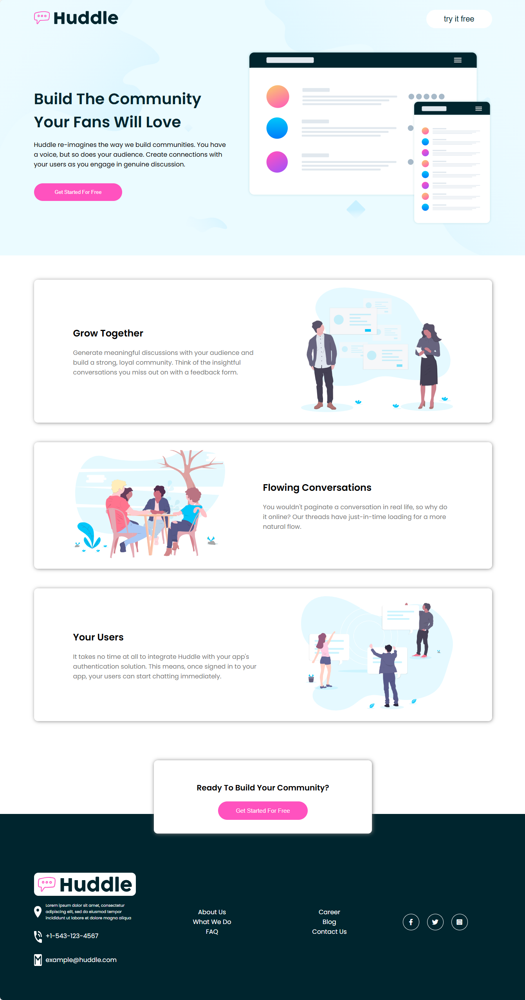

# Frontend Mentor - Huddle landing page with alternating feature blocks

This is a solution to the [Huddle landing page with alternating feature blocks](https://www.frontendmentor.io/challenges/huddle-landing-page-with-alternating-feature-blocks-5ca5f5981e82137ec91a5100). Frontend Mentor challenges help you improve your coding skills by building realistic projects.

## Table of contents

- [Overview](#overview)
  - [The challenge](#the-challenge)
  - [Screenshot](#screenshot)
  - [Links](#links)
- [My process](#my-process)
  - [Built with](#built-with)
  - [What I learned](#what-i-learned)
  - [Continued development](#continued-development)
- [Author](#author)
- [Acknowledgments](#Acknowledgments)

## Overview

### The challenge

This challenge is perfect if you're wanting to practice your layout skills. If you're starting to get a bit more confident laying out a web page, give this project a go.

Your users should be able to:

- View the optimal layout for the interface depending on their device's screen size
- See hover and focus states for all interactive elements on the page

### Screenshot



### Links

- Solution URL: [here](https://github.com/olahasan/HTML_AND_CSS_Frontend-Mentor_-JUNIOR-Huddle-landing-page-with-alternating-feature-blocks)

- Live Site URL: [here](https://olahasan.github.io/HTML_AND_CSS_Frontend-Mentor_-JUNIOR-Huddle-landing-page-with-alternating-feature-blocks/)

## My process

### Built with

- Semantic HTML5 markup
- CSS custom properties
- Flexbox
- CSS Grid
- Mobile-first workflow

### What I Learned

In this project, I learned how to effectively use Flexbox and CSS Grid to create responsive layouts. I also improved my skills in using media queries to ensure the design adapts well to different screen sizes.

```html
<div class="container">
  <h2>Quick Search</h2>
  <p>
    Easily search your snippets by content, category, web address, application,
    and more.
  </p>
</div>
```

```css
.container {
  display: flex;
  flex-direction: column;
  align-items: center;
}
```

### Continued Development

In future projects, I plan to focus on improving accessibility by using ARIA roles and labels. I also aim to explore more advanced CSS techniques and JavaScript to add interactivity to my projects.

### Author

Frontend Mentor - @olahasan<br>
GitHub - @olahasan

### Acknowledgments

Thanks to **Frontend Mentor** for providing this challenge and to the community for their support and feedback
